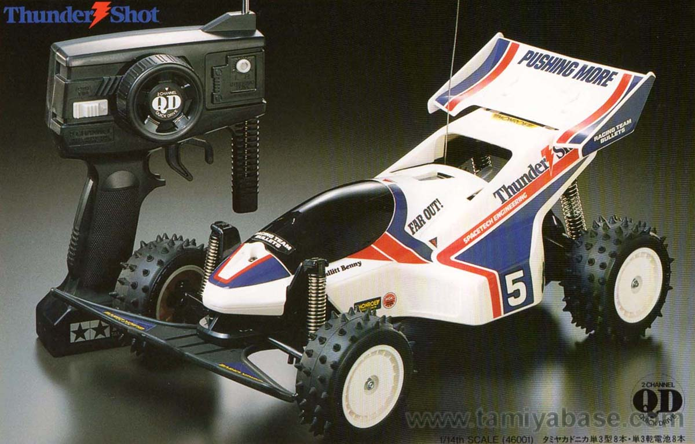
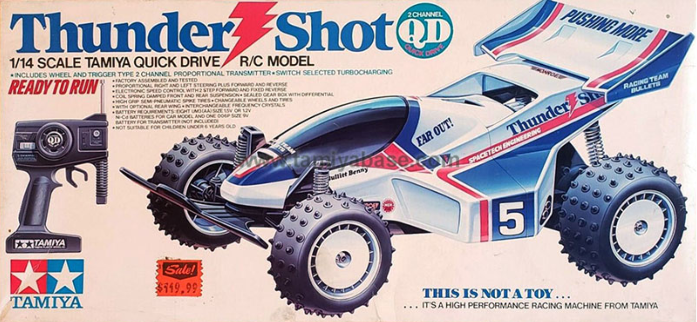
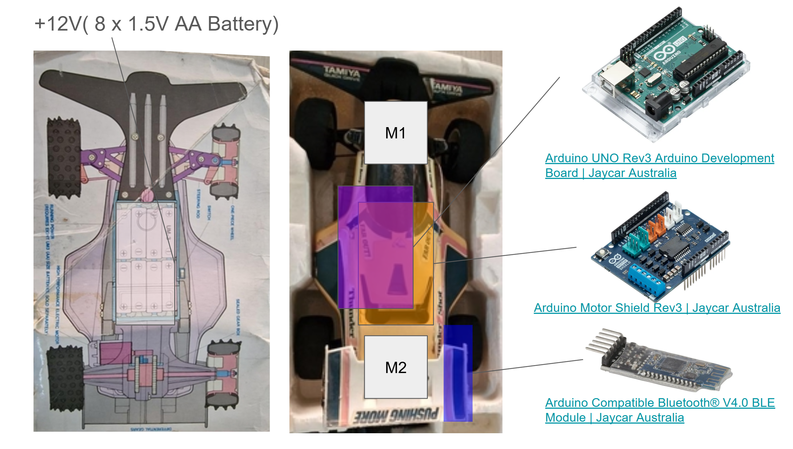
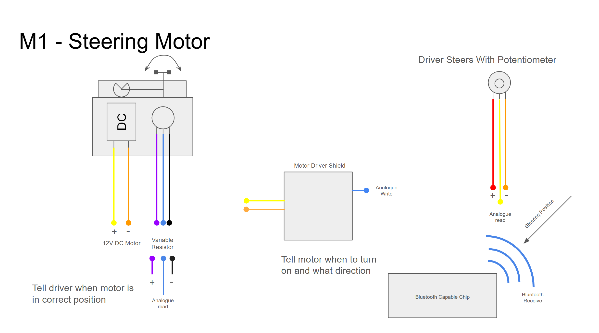
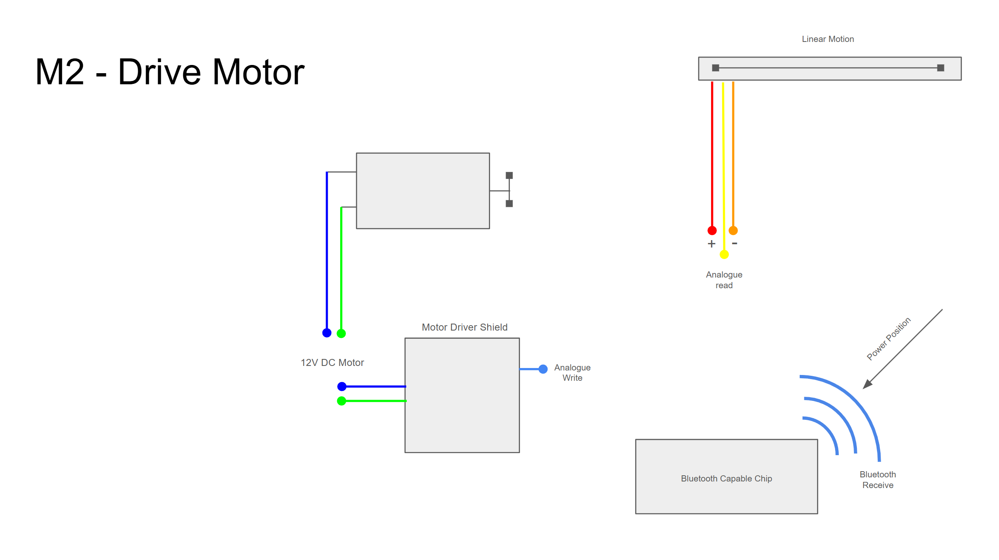
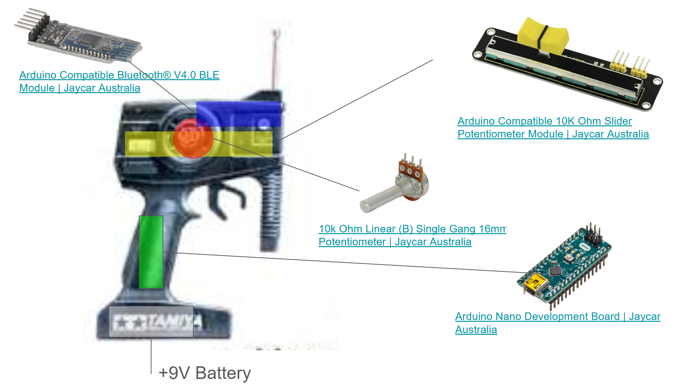
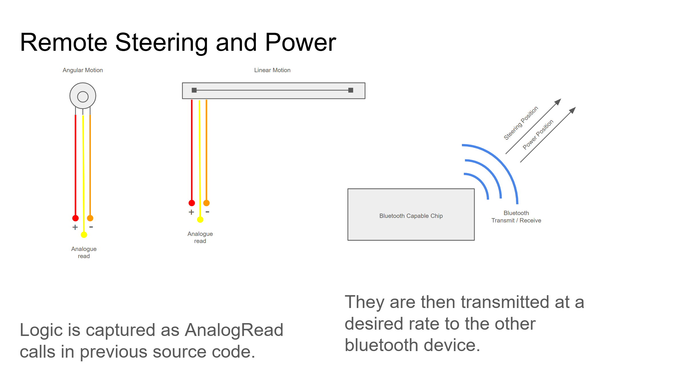
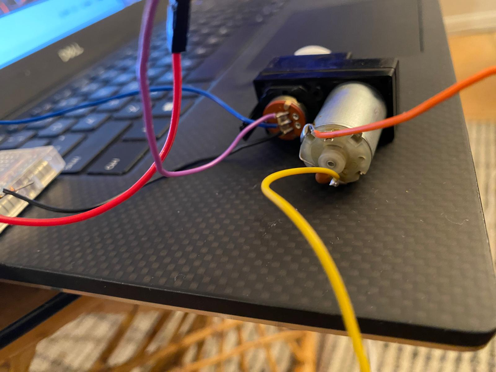
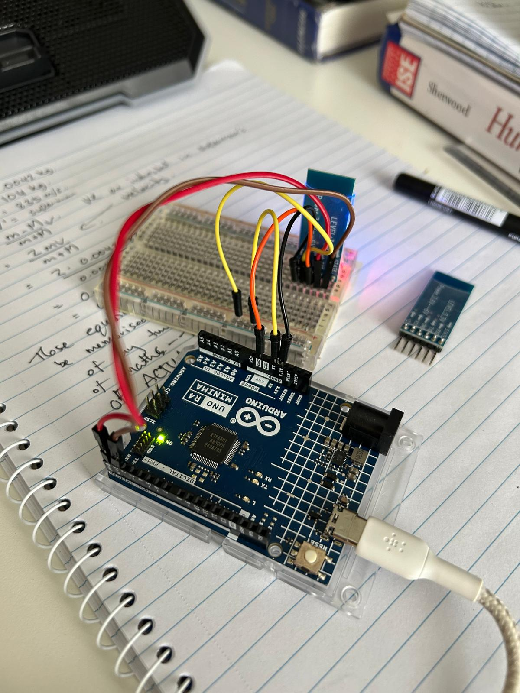
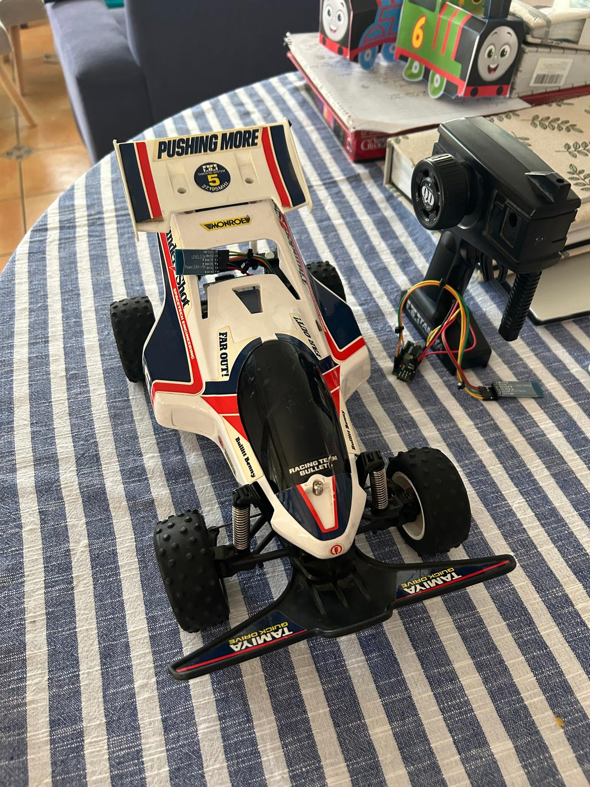

# Tamiya Thunder Shot 46001 Rebuild

<figure>

<br>
<figcap>Image retrieved from
 <a href="https://tamiyabase.com/tamiya-models/46001">https://tamiyabase.com/tamiya-models/46001</a>
</figcap>
</figure>
<br>

This project details the rebuild of my old remote control car using Arduino boards
and other consumer electronics components. Beginning in January 2023 and completed
in January 2025, in my spare time I took my very old Tamiya Thunder Shot QD (46001)
which no longer worked, and restored it to working condition.

I do not have any formal mechanical or electronic training, and so being self-taught 
I was able to solve problems bottom up without any preconcieved notions of what is
"the right" way to approach it. Consequently I was able to develop a great deal of intuition
as to why the car was built the way it was, as well as understand first hand the contraints
of a real-time remote controller. Of course, I was limited to what I understood to be
functional solutions to my problems, rather than best-in-class solutions. However, for most
solutions it amounted to only a difference of degree rather than kind. The result is a 
fully operational remote control car, reviving the childhood joy I remember experiencing when playing
with this car. Indeed, for those familiar with these toys, one of the most striking and
visceral elements is the sound of the motor.

I've included a video below of the final result with me driving it, which cements the sound
 of a deep childhood memory.

<figure>
<video src="https://github.com/user-attachments/assets/88d9535b-7807-441a-a4aa-c4f131b0bca7" height="600" controls></video>
<br>
<figcap><b>Test Drive:</b> Final test drive of the car.</figcap>
</figure>
</br>

## Thunder Shot 46001


| Detail | Value |
| --- | --- |
| **Model number(s)** | 46001 |
| **Model name** | Thunder Shot QD |
| **Model group** | Quick Drive Series |
| **Kit type** | Factory Built, with Radio |
| **Scale** | 1/14 |
| **Release date** | 31 May 1988 |
| **Type of model** | Buggy |
| **Body material** | ABS |


The above information is an overview of the car [\[1\]](#ref_1).
From the release date, you can see
that we are dealing with a ~35 year old car by the year 2023. From memory I believe
the experience involved a lot of anticipation while we (my older siblings and I) charged
the batteries, which when finally ready, gave us a joyous yet fleeting 5 to 10 minutes of drive
time. Afterwards those batteries went straight back onto the charger for what was another
few hours. Being the youngest, I think I hardly had a turn, but we know there is magic in
spectator sports [\[2\]](#ref_2).

I think it stop working after only a few years. I can't remember why because I was only very
young (4-6 years old). After that it became a fixture in my imagination, hoping to one day
see it working again. I never actually had another remote control car after this one, although
they obviously became increasingly cheaper and performative. Regardless, this was the only car for me.

## Design Overview

There are two major sub-systems to the car, namely the car itself (System I), and the remote controller (System II).

<figure>

<br>
<figcap>Image retrieved from
 <a href="https://tamiyabase.com/box-art/518-46001">https://tamiyabase.com/box-art/518-46001</a>
</figcap>
</figure>
<br>

### System I

<figure>

<br>
<figcap>System I consists of 6 components: Batteries, Motor 1 (M1), Motor 2 (M2), Arduino logic controller, Arduino motor shield and a bluetooth module
</figcap>
</figure>
<br>

The car itself has two motors, referred to in the schematic as M1 and M2. M1 controls the steering, and M2 controls the propulsion. Both of them need to be powered by a motor shield which is controlled by the Arduino. In my case I chose an [Arduino UNO Rev 3](#com_1) and its compatible [Motor Shield](#com_2). Over the course of experimentation, I played around with different boards and shields, finally settling on this pair.
Lastly, to recieve signals from the remote I chose a master-slave [Bluetooth Module](#com_3) pair. 
Ironically the car bluetooth module was designated as the master while only passively receiving 
instructions.


<figure>

<br>
<figcap>M1 Schematic.
</figcap>
</figure>
<br>


#### Example Motor Code

The following code gives an indication of the kind of logic I used to control both the motors. This
code uses an older motor shield library, incompatiable with the Arduino UNO Rev 3. However, the gist is the same. Similarly, Motor 2 works on the same principle of being given an analogue read value (recieved via Bluetooth) which corresponds to the amount of power to apply.

```cpp
#include <AFMotor.h>


AF_DCMotor motor(1); // which motor it is connected to

int SPEED = 150;


int servoReadPin = A8;
int steerReadPin = A9;
int servoPos = 0;
int lastSteerPos = 0;
int steerPos = 0;
int DIRECTION = 4;
int THRESHOLD = 5;

int SERVO_AVG = 107;
int SERVO_MIN = 85;
int SERVO_MAX = 130;


void setup() {
  Serial.begin(9600);
  motor.setSpeed(SPEED);
  motor.run(RELEASE);
 
}

void loop() {

  // Read servo position
  servoPos = analogRead(servoReadPin);
  servoPos = map(servoPos, 0, 1023, 0, 180);

  // Read steering position
  steerPos = analogRead(steerReadPin);
  steerPos = map(steerPos, 0, 1023, SERVO_MIN-10, SERVO_MAX+10);

  Serial.println(String(servoPos) + " " + String(steerPos));

  // Check MIN and MAX
  if (servoPos >= SERVO_MAX){
	motor.run(RELEASE); // STOP
  }

  if (servoPos <= SERVO_MIN) {
	motor.run(RELEASE); // STOP
  }

  // Check if it needs to move
  if (steerPos > servoPos+THRESHOLD){ 	 
  	motor.run(BACKWARD);
  	delay(3);
  	// Stop it
  	motor.run(RELEASE);
  }

  if (steerPos < servoPos-THRESHOLD) {
  	motor.run(FORWARD);
  	delay(3);
  	// Stop it
  	motor.run(RELEASE);
  }
   
}


```
<br>
<br>

<figure>

<br>
<figcap>M2 Schematic.
</figcap>
</figure>
<br>

As mentioned, we take an analogue read value and map it to a value that determines the speed at which the drive motor should run.

### System II

<figure>

<br>
<figcap>System II consists of 5 components: Batteries, Slider Linear Potentiometer, Rotational Linear Potentiometer, Arduino logic controller, and a bluetooth module
</figcap>
</figure>
<br>
<br>

The remote has two main physical controllers, namely the trigger which controls drive power, and the steering dial. Both of these mechanisms translate physical position using a linear potentiometer. 
For the power I used a [slider](#com_4), modifying it so it would work with the trigger mechanism.
I only used a small range of the slider, maping the read values to a usable range. The steering
mechanism remained intact, in taking it apart I learned it was a regular [potentiometer](#com_5).
Again, I had the other Bluetooth pair and finally controlled all the logic via an
[Arduino Nano Development Board ](#com_6). Amazingly I was able to fit all of these components into the housing of the remote without too much trouble.

<figure>

<br>
<figcap>System II Schematic.
</figcap>
</figure>
<br>

Although I do not have the exact code I used for the Bluetooth modules, there are plenty of tutorials online about paring them together [\[3\]](#ref_3).


## Components

All components were sourced from Jaycar Australia.

1. <span id="com_1"></span> [Arduino UNO Rev3 Arduino Development Board](https://www.jaycar.com.au/arduino-uno-rev3-arduino-development-board/p/XC9202)
2. <span id="com_2"></span> [Arduino Motor Shield Rev3 ](https://www.jaycar.com.au/arduino-motor-shield-rev3/p/XC9207)
3. <span id="com_3"></span> [Arduino Compatible Bluetooth® V4.0 BLE Module](https://www.jaycar.com.au/arduino-compatible-bluetooth-v4-0-ble-module/p/XC4382)
4. <span id="com_4"></span> [Arduino Compatible 10K Ohm Slider Potentiometer Module](https://www.jaycar.com.au/arduino-compatible-10k-ohm-slider-potentiometer-module/p/XC3734)
5. <span id="com_5"></span> [10k Ohm Linear (B) Single Gang 16mm Potentiometer ](https://www.jaycar.com.au/10k-ohm-linear-b-single-gang-16mm-potentiometer/p/RP7510)
6. <span id="com_6"></span> [Arduino Nano Development Board](https://www.jaycar.com.au/arduino-nano-development-board/p/XC9206)


## Gallery

<figure>

<br>
<figcap><b>Steering Motor: </b>M1  with the casing removed. Shows it is a DC motor coupled with a potentiometer. There is a gear on the end of the motor which then turns the potentiometer, which
can then simultaneously be read to determine its position.</figcap>
</figure>
<br>

<figure>

<br>
<figcap><b>Bluetooth: </b>Here is one of the early prototypes of working with the bluetooth module using
the Arduino UNO.</figcap>
</figure>
<br>

<figure>
<video controls src="https://github.com/user-attachments/assets/dc5f7a45-2a50-4fde-9c7b-64004f16651e" height="400"></video>
<br>
<figcap><b>Early Steering Test: </b>A steering test using an early prototype, with an Arduion MEGA 
and compatible motor shield.</figcap>
</figure>
<br>


<figure>
<video controls src="https://github.com/user-attachments/assets/bcf5acfc-f3d0-488c-8680-090ae9c0b51e" height="400"></video>
<br>
<figcap><b>Remote Control Test: </b>Testing the remote control setup.</figcap>
</figure>
<br>


<figure>

<br>
<figcap><b>Final Car: </b>Everything put back together, minus fitting all the components into 
the remote e.g. Arduino NANO and Bluetooth Module.</figcap>
</figure>
<br>

## Conclusion

This project was my first major foray into Arduino, building something both useful and challenging. At the end of it I would say that the cost of experimenting, blurning boards, replacement parts, breaking components by accident etc amounted to the most expensive remote control car project ever! Something on the order of \$300-\$400. As a comparison, I bought my son a brand new remote control car from Jaycar for \$35, and it far surpasses the quality and robustness of the Thundershot rebuild. However,
it was a fun and educational journey that had many many obstacles that needed to be overcome. If any
thing the completion of the project was a testament to the need to carry on, and so long as we are moving forward we will reach our destination. Two years of fun, challenges and learning amounts
to pennies in that context. It also set me up nicely for more ambition projects in the future.

## References

1. <span id="ref_1"></span> Tamiya Base. *Tamiya Thunder Shot QD (46001)*. Available from https://tamiyabase.com/tamiya-models/46001
2.  <span id="ref_2"></span> Ownsworth et. al (2024). *Watching sports is good for you – thanks to its social bonding effects*. https://doi.org/10.64628/AB.vmj4fg55a Available at: https://theconversation.com/watching-sports-is-good-for-you-thanks-to-its-social-bonding-effects-231781
3. <span id="ref_3"></span> How To Mechatronics (2016). *How To Configure and Pair Two HC-05 Bluetooth Module as Master and Slave | AT Commands*. Available at: https://www.youtube.com/watch?v=hyME1osgr7s